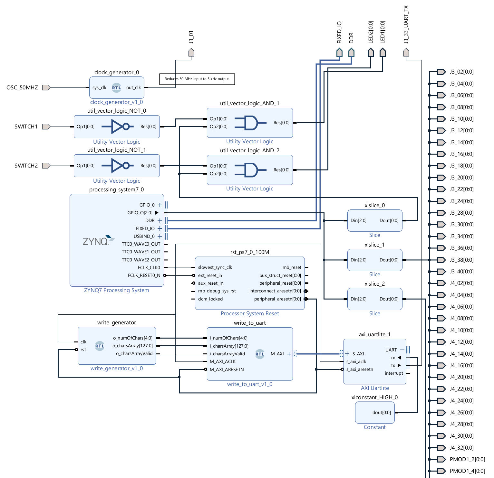

# Board demo HW & SW

## Demo functionality

The demo does the following:

- Board's LED1 and LED2 blink with 2.5 Hz frequency.

- Board's SWITCH1 disables blinking of LED1. SWITCH2 disables LED2.

- Testing serial output is provided on the UART Micro-USB connector. 
  
  - Connect your computer to the board's UART Micro-USB connector. A new COM port should became available in the operating system. Connect a terminal program (e.g. [PuTTY](https://www.putty.org/)) to given COM port, set the speed to 9600 baud. You then shall see increasing series of numbers in the terminal (25 lines per second).
  - Activity of the board's serial output is also indicated by fast blinking yellow TX LED on the board.

- J3_1 provides the 3.3 V square wave signal of frequency 5 kHz, which is exactly ten thousand times de-scaled 50 MHz frequency signal from the oscillator X1.

- Other pins with odd pin number on J3, J4 and PMODs provide the square wave signal of frequency 166.6 Hz (5 V on PMOD1 and PMOD2, 3.3 V on other connectors).

- Pins with even pin number on J3, J4 and PMODs provide the square wave signal of frequency 80.6 Hz.

&nbsp;

Following pins are <ins>not used</ins> by the demo:

- J3_32_UART_RX &ndash; serial receive pin from the USB-to-UART chip.

- J3_46 and J3_47 – analog input ports XADC VP/VN.

- J3_50 and J3_51 – temperature-sensing diode pins not usable by PL (see [7 Series Pinout UG475](https://www.xilinx.com/support/documentation/user_guides/ug475_7Series_Pkg_Pinout.pdf), Table1-12).

- Following pins do nothing when using MicroZed 7010, because respective Zynq pins simply don't exist on the 7010 chip:
  
  - J3_26
  
  - J3_42..45
  
  - J3_48..49
  
  - J3_52
  
  - J4_18..19
  
  - J4_34..38

## Demo HW design and SW code

The demo uses simple HW design and standalone bare-metal code running on a ZYNQ ARM core.

Three EMIO GPIO pins are exposed from the ZYNQ Processing System. They are then sliced to three separate signals.

First signal drives the LEDs. Activation of a switch drives a LED low despite GPIO signal being high.

Second GPIO signal is connected to ports with even pin numbers. Third GPIO signal drives ports with odd pin numbers.

- Note: I didn't create and connect 106 output ports in the Vivado Diagram by clicking and dragging.:smiley: I created a TCL script using [create_bd_port](https://docs.xilinx.com/r/en-US/ug835-vivado-tcl-commands/create_bd_port) and [connect_bd_net](https://docs.xilinx.com/r/en-US/ug835-vivado-tcl-commands/connect_bd_net) commands.
  For example the port J3_02 was added to the diagram created by a command: 
  
  ```
  create_bd_port -dir O -type data J3_02; connect_bd_net [get_bd_pins /xlslice_1/Dout] [get_bd_ports /J3_02]
  ```

Instance of a clock_generator module descales input 50 MHz signal from the oscillator X1 by factor 10,000.


